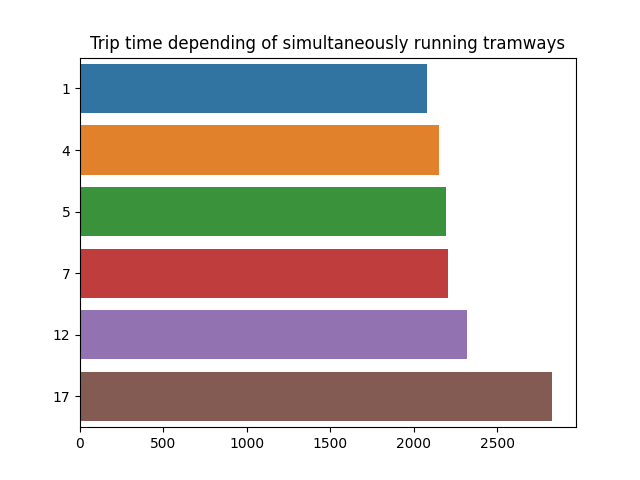

# Tramway Simulator
Simulator for single track railroad. The tramways can only cross when waiting at a station.


```
    /-----\          /-----\         /-----\
----Station----------Station---------Station------
    \-----/          \-----/         \-----/
```


The aim of this project is to measure the trip time loss between two configurations : 
* a single tramway line with 2 parallel tracks
* a single tramway line with only one track between stations and 2 tracks only at the stations

The simulation parameters are : 
* number of stations in the line (measured with 20 stations)
* trip time between two stations : considered randomly between 50s and 70s
* waiting time at each station : considered randomly between 40s and 60s

The simulators allows to speed up the tramways and to add more simultaneous tramways on the line. Of course with more tramways, they will need more waiting time before a track is available. 

### Build 

`npm install`

`npm run build`

Then call dist/index.html into a browser

### Considered situations for 20 stations

* 4 simultaneous tramways on each direction
* 5 simultaneous tramways on each direction
* 7 simultaneous tramways on each direction
* 17 simultaneous tramways on each direction (saturation)

### Expected results

We can expect the mean trip time to increase when more tramways are running on the line. Is there a maximum number of tramways with an acceptable trip time ?


### Results

It appears that the simultaneous tramways do not significantly increase the trip time, especially in a common situation with few tramways running at the same time. 4 tramways in each direction for only 20 stations is already a quite numerous situation.

For cities with small paths, the idea of using only one track between the stations may bring new opportunities without penalizing too much the trip times. 

Of course this more dynamic situation requires a stronger railroad infrastructure because of the continuous switch between tracks before and after each station.